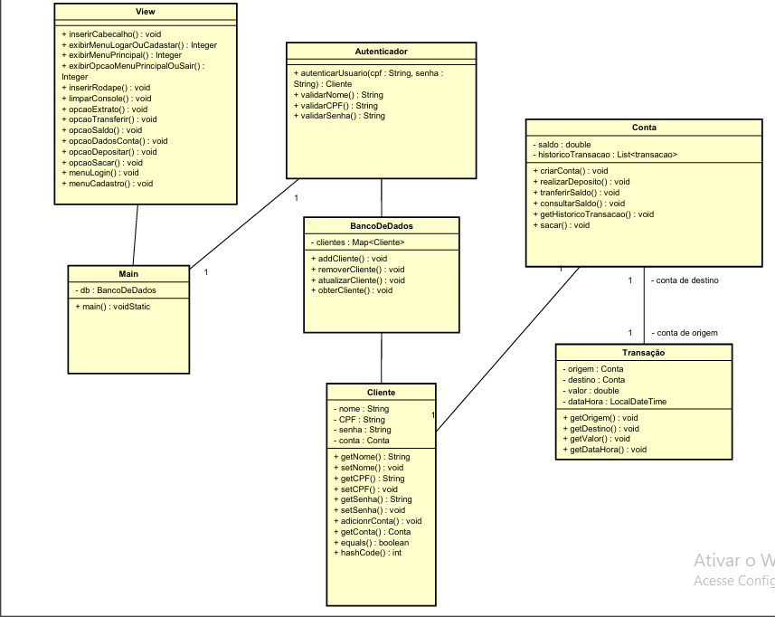

# Sistema-de-Gerenciamento-de-Banco
Um sistema de gerenciamento bancário.

<h2>Criar um novo cliente:</h2>

-Deverá ser inserido um nome válido. O nome não pode ser nulo, vazio ou ter numerais.

-Um CPF válido (11111111111 ou 111.111.111-11). Aqui validamos apenas o formato do CPF e a quantidade de númerais. Não fizemos a validação com o calculo real do CPF por motivos de apresentação.

-Uma senha numerica de 6 digitos.

-O login será validado por meio do CPF e senha.

<h2>Menu Principal</h2>

Segue abaixo a estrutura do Menu principal: 

 

=================================

SISTEMA DE GERENCIAMENTO BANCARIO

=================================

O QUE DESEJA FAZER:

1 - VER SALDO

2 - DEPOSITAR

3 - SACAR

4 - TRANSFERIR

5 - EXTRATO

6 - DADOS DA CONTA

0 - SAIR

=================================
 

