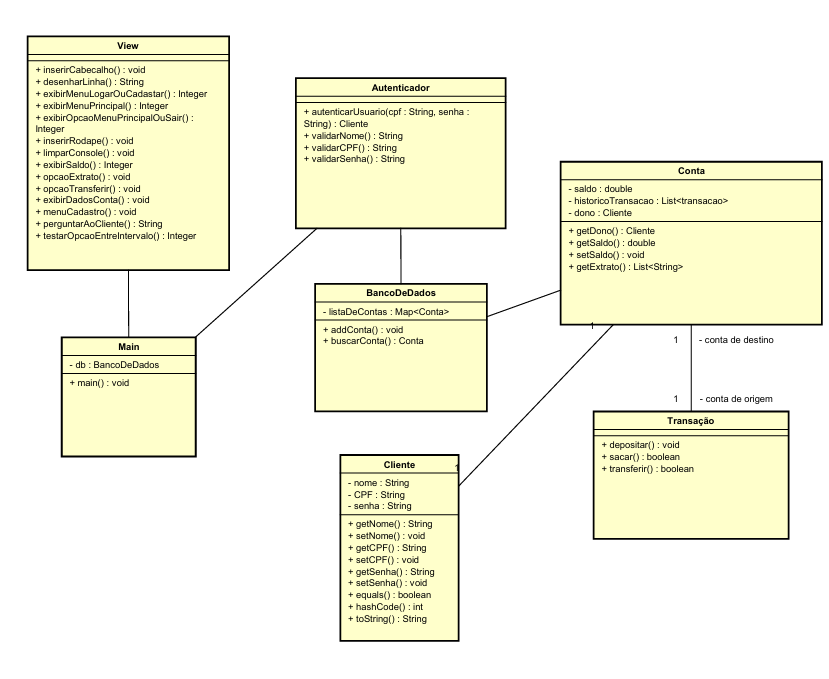

# Sistema-de-Gerenciamento-de-Banco
Um sistema de gerenciamento bancário.

<h2>Criar um novo cliente:</h2>

-Deverá ser inserido um nome válido. O nome não pode ser nullo, vazio ou ter numerais.

-Um CPF válido (11111111111 ou 111.111.111-11)

-Uma senha numerica de 6 digitos.

-O login será validado por meio do CPF e senha.

